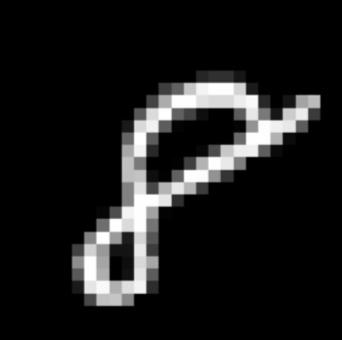
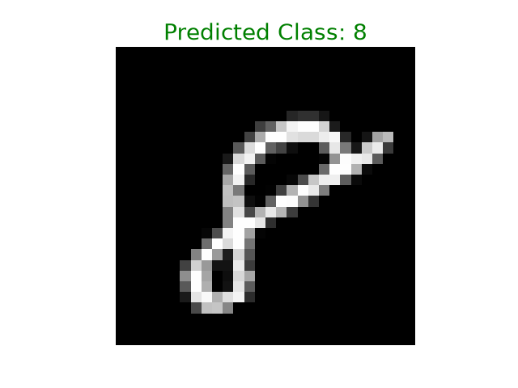
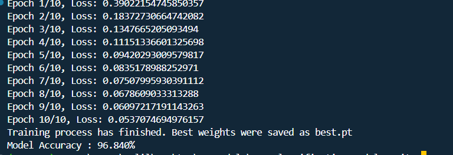
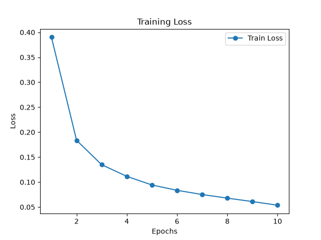

>Language: English 🇺🇸<br>

For Turkish : [Turkish](README_tr.md)


# Definition
 This project, includes a model's; <br>
 * Training process detailts<br>
 * Working logic
 * Model outputs 
 * Performance Evaluation
 * Installation and usage<br>

which uses ANN (Artifical Neural Networks) and was trained with MNIST dataset.
 

### What is ANN (Artificial Neural Network) ? 
* ANN is the building block of the Artificial Intelligence which provides a computer to decide by learning from its mistakes, powered by the inspiration of the human brain's working system and structure. It uses a system which is similar to the human brain's neuron structure while deciding. Inputs are connected to each neuron by getting multiplied with weights and provide a neuron to produce a numeric value by getting added to a constant value so-called bias. Connections that continue through the layers produce an output in the last layer. The final number turns into a possibility value by going through Sigmoid function and represents the possibility of its class. Then, the model computes loss value by looking at possibilities and the true class (Cross-Entropy Loss). Gradiants are calculated and weights are updated (Learning). Thus, the model apply its best settings and learns. 

#### Artificial Neural Network learning steps
- Forward Propagation
- Sigmoid Function
- Loss Calculation
- Gradiant Calculation
- Weight Update <br>

>[!NOTE]
> Last 2 steps represent the Backward Propagation phase.

## Training Process details

**Model**: `Artificial Neural Network (ANN)` <br>
**Task**: `Digit Detection` <br>
**Epoch**:`10` <br>
**Dataset**: [MNIST](https://docs.pytorch.org/vision/main/generated/torchvision.datasets.MNIST.html) <br>
**Input image shape**: `28x28` <br>
**Tech stack**: ,,

## Model Outputs
- After the model had been trained for 10 epochs, the model was tested with an image which was not seen by the model previously and the model's prediction was written on the image.

|Test Image | Model Prediction    |
| --- | ---- |
|    |  | 
>[!IMPORTANT]
> The trained model, takes one dimension vectors as inputs instead of multiple dimension matrices in order to predict. Therefore if one wants to test the model, the input image must go through the processes below:
```python 
#image pre-process phase
img=cv.imread("testing_image.png",cv.IMREAD_GRAYSCALE)
img_resized=cv.resize(img,(28,28))
img_normalized=img_resized/255.0
img_tensor=torch.tensor(img_normalized, dtype=torch.float32)
img_vector=img_tensor.view(1,784)
```
## Performance Evaluation
- The model has produced less loss value progressively during the 10 epoch training process. During the training process, the loss values which were produced in each epoch were printed in the terminal.


- As it is seen, while the model produces 0.39 loss value during the first epoch, when it comes to the last epoch, it has reduced this value to 0.05 and completed learning process.<br>

- **Model Accuracy** value in the last row represents the model's success rate on the test dataset.

>[!IMPORTANT]
>Epoch variable is a hyperparameter for the model training. While determining the value of this parameter, the loss values in the terminal must be analyzed and the training must be ended if the value is not decreasing after a certain point. Otherwise, *Overfitting* occurs. <br>

- On the graph below, the progressive decrease of the model's loss value was demonstrated. 
<div align="center">
  <h4>LOSS VALUE GRAPH</h4>
  
</div>

## Installation and usage
Follow the instructions below in order to install the model to your local computer and test: <br>

1-
```bash
#Clone the repo to your local computer.
git clone https://github.com/halileroglu711/ANN-classification-mnist.git 
```
2-
```bash
#Enter to the project folder.
cd ANN-classification-mnist
```
3-
```bash
#Install the required libraries.
pip install -r requirements.txt
```
4-
```bash
#Start the training.
python main.py
```
5-
```bash
#Test the model with the sample image.
python test.py
```
## Project Folder Structure
```text
ANN-classification-mnist/
│
├── assets/
│   ├── model-prediction.png 
│   ├── testing_image.png
│   ├── training_loss_graph.png
|   └── training-process.png
| 
├── weights/
|    └── best.pt
│
├── .gitignore
├── classes.py
├── functions.py
├── main.py
├── README_tr.md
├── README.md
├── requirements.txt
└── test.py
```

### ©️ License
This project is licensed under MIT license <br>
Check 🔍[License](LICENSE) for further detail.

### 📬 Contact
- Herhangi bir hatam varsa bana bildirin🙋. Katkılarınızı bekliyorum 🙂.Bana buradan ulaşabilirsiniz:

[](www.linkedin.com/in/halil-eroğlu-5505783a1)
[](https://github.com/halileroglu711)
[](mailto:halileroglu711@gmail.com)


